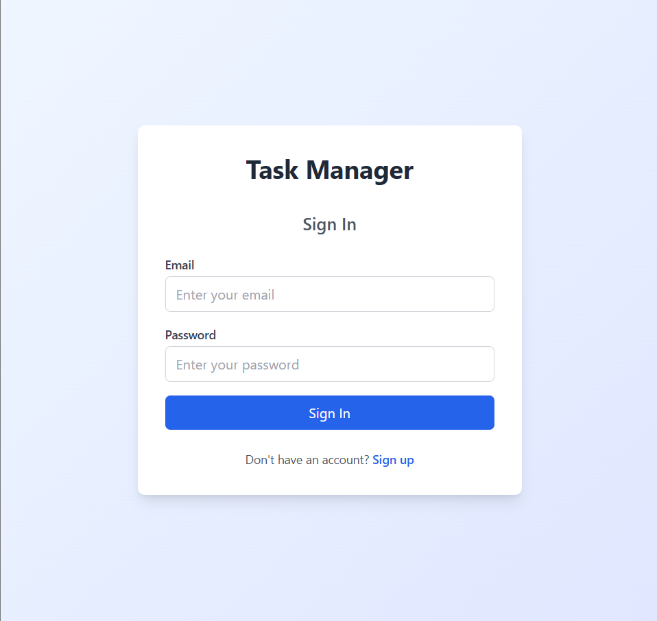
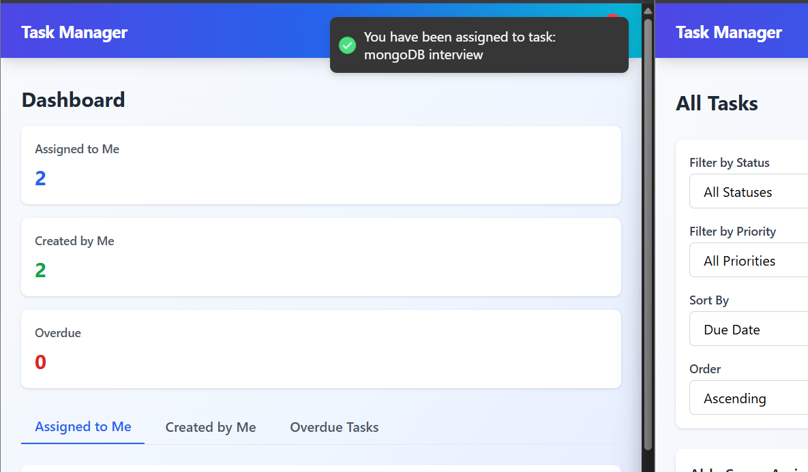
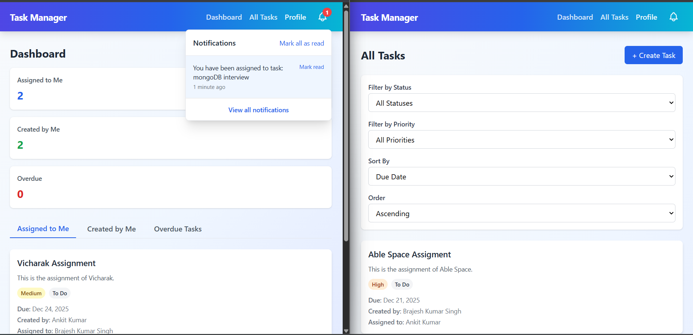

# Collaborative Task Manager

A full-stack, production-ready collaborative task management application built with Node.js, Express, MongoDB, React, and Socket.io for real-time collaboration.

## 🌐 Live Demo

The application is live and deployed on Render:

**🔗 [Live Application](https://taskmanager-application-irhj.onrender.com/)**

Both frontend and backend are deployed on Render's free tier. You can access the application and test all features including authentication, task management, and dashboard functionality.

## 🚀 Features

### Authentication & Authorization
- User registration and login
- JWT-based authentication
- Password hashing with bcrypt
- Protected routes with middleware
- User profile management



*Login page showing authentication interface*

### Task Management (Full CRUD)
- Create, read, update, and delete tasks
- Task properties:
  - Title (max 100 characters)
  - Description (multiline)
  - Due date
  - Priority (Low, Medium, High, Urgent)
  - Status (To Do, In Progress, Review, Completed)
  - Creator and assignee tracking
- Zod validation for all inputs

### Real-Time Collaboration (Socket.io)
- Real-time updates when tasks are:
  - Created
  - Updated (status, priority, assignee changes)
  - Deleted
- Instant notifications when tasks are assigned to users
- Socket authentication with JWT



*Real-time notification toast when a task is assigned to you*



*Notification popup showing task assignment notifications with bell icon indicator*

### Dashboard & Data Exploration
- Tasks assigned to logged-in user
- Tasks created by logged-in user
- Overdue tasks (dueDate < now & not completed)
- Filtering by status and priority
- Sorting by dueDate (ascending & descending)

### Frontend Features
- Clean, responsive Tailwind CSS UI
- Mobile-first design
- Skeleton loaders for loading states
- Toast notifications for success/error states
- Zustand for global state management
- SWR for data fetching and caching
- React Hook Form + Zod for form validation

## 📁 Project Structure

```
AbleSpaceAssignment/
├── backend/
│   ├── src/
│   │   ├── config/
│   │   │   ├── db.js          # MongoDB connection
│   │   │   ├── env.js         # Environment configuration
│   │   │   └── socket.js      # Socket.io setup
│   │   ├── models/
│   │   │   ├── User.js        # User model
│   │   │   └── Task.js        # Task model
│   │   ├── routes/
│   │   │   ├── auth.routes.js
│   │   │   ├── task.routes.js
│   │   │   └── user.routes.js
│   │   ├── controllers/
│   │   │   ├── auth.controller.js
│   │   │   ├── task.controller.js
│   │   │   └── user.controller.js
│   │   ├── services/
│   │   │   ├── auth.service.js
│   │   │   ├── task.service.js
│   │   │   └── notification.service.js
│   │   ├── middleware/
│   │   │   ├── auth.middleware.js
│   │   │   └── error.middleware.js
│   │   ├── validators/
│   │   │   ├── auth.dto.js    # Zod schemas for auth
│   │   │   └── task.dto.js    # Zod schemas for tasks
│   │   ├── tests/
│   │   │   └── task.service.test.js
│   │   ├── app.js
│   │   └── server.js
│   ├── package.json
│   └── .env.example
│
└── frontend/
    ├── src/
    │   ├── api/
    │   │   ├── axios.js        # Axios instance
    │   │   ├── auth.api.js
    │   │   ├── task.api.js
    │   │   └── user.api.js
    │   ├── store/
    │   │   ├── auth.store.js  # Zustand auth store
    │   │   └── socket.store.js # Zustand socket store
    │   ├── hooks/
    │   │   └── useTasks.js     # SWR hooks
    │   ├── components/
    │   │   ├── TaskCard.jsx
    │   │   ├── TaskForm.jsx
    │   │   ├── Loader.jsx
    │   │   └── Notification.jsx
    │   ├── pages/
    │   │   ├── Login.jsx
    │   │   ├── Register.jsx
    │   │   ├── Dashboard.jsx
    │   │   ├── Tasks.jsx
    │   │   └── Profile.jsx
    │   ├── utils/
    │   │   └── socket.js
    │   ├── App.jsx
    │   ├── main.jsx
    │   └── index.css
    ├── package.json
    ├── vite.config.js
    ├── tailwind.config.js
    └── postcss.config.js
```

## 🛠️ Tech Stack

### Backend
- **Node.js** - Runtime environment
- **Express.js** - Web framework
- **MongoDB** - Database
- **Mongoose** - ODM
- **JWT** - Authentication
- **bcrypt** - Password hashing
- **Socket.io** - Real-time communication
- **Zod** - Schema validation
- **Jest** - Testing framework

### Frontend
- **React** - UI library
- **Vite** - Build tool
- **Tailwind CSS** - Styling
- **Zustand** - State management
- **SWR** - Data fetching
- **Axios** - HTTP client
- **Socket.io-client** - Real-time client
- **React Hook Form** - Form handling
- **Zod** - Validation
- **React Hot Toast** - Notifications

## 📦 Installation & Setup

### Prerequisites
- Node.js (v18 or higher)
- MongoDB (local or MongoDB Atlas)
- npm or yarn

### Backend Setup

1. Navigate to backend directory:
```bash
cd backend
```

2. Install dependencies:
```bash
npm install
```

3. Create `.env` file (copy from `.env.example`):
```bash
PORT=5000
MONGODB_URI=mongodb://localhost:27017/taskmanager
JWT_SECRET=your-super-secret-jwt-key-change-in-production
NODE_ENV=development
```

4. Start MongoDB (if running locally):
```bash
# Make sure MongoDB is running on your system
```

5. Start the backend server:
```bash
# Development mode
npm run dev

# Production mode
npm start
```

The backend will run on `http://localhost:5000`

### Frontend Setup

1. Navigate to frontend directory:
```bash
cd frontend
```

2. Install dependencies:
```bash
npm install
```

3. Create `.env` file (optional):
```bash
VITE_API_URL=http://localhost:5000/api
VITE_SOCKET_URL=http://localhost:5000
```

4. Start the development server:
```bash
npm run dev
```

The frontend will run on `http://localhost:5173`

## 🧪 Testing

### Backend Tests

Run Jest tests:
```bash
cd backend
npm test
```

The test suite includes:
- Task creation validation
- Task update with change detection
- Authorization checks for task updates/deletes

## 📡 API Endpoints

### Authentication
- `POST /api/auth/register` - Register new user
- `POST /api/auth/login` - Login user
- `GET /api/auth/profile` - Get user profile (protected)
- `PUT /api/auth/profile` - Update user profile (protected)

### Tasks
- `GET /api/tasks` - Get all tasks (protected)
  - Query params: `status`, `priority`, `sortBy`, `sortOrder`
- `GET /api/tasks/my-created` - Get tasks created by user (protected)
- `GET /api/tasks/my-assigned` - Get tasks assigned to user (protected)
- `GET /api/tasks/overdue` - Get overdue tasks (protected)
- `GET /api/tasks/:id` - Get single task (protected)
- `POST /api/tasks` - Create task (protected)
- `PUT /api/tasks/:id` - Update task (protected)
- `DELETE /api/tasks/:id` - Delete task (protected)

### Users
- `GET /api/users` - Get all users (protected)

### Health Check
- `GET /health` - Server health check

## 🔌 Socket.io Events

### Client → Server
- Connection with JWT token in `auth.token`

### Server → Client
- `task:created` - Emitted when a task is created
- `task:updated` - Emitted when a task is updated
  - Payload: `{ task, changes }`
- `task:deleted` - Emitted when a task is deleted
  - Payload: `{ taskId }`
- `notification` - Emitted to specific user when assigned to a task
  - Payload: `{ type, message, taskId, timestamp }`

## 🏗️ Architecture

### Backend Architecture (MVC)

**Models**: Define data schemas and business logic
- `User.js` - User schema with password hashing
- `Task.js` - Task schema with indexes

**Controllers**: Handle HTTP requests and responses
- Extract data from requests
- Call services
- Return responses

**Services**: Business logic layer
- `auth.service.js` - Authentication logic
- `task.service.js` - Task CRUD operations
- `notification.service.js` - Notification creation

**Routes**: Define API endpoints
- Mount controllers
- Apply middleware

**Middleware**:
- `auth.middleware.js` - JWT verification
- `error.middleware.js` - Centralized error handling

**Validators**: Zod schemas for request validation
- `auth.dto.js` - Auth validation schemas
- `task.dto.js` - Task validation schemas

### Frontend Architecture

**State Management**:
- Zustand stores for global state (auth, socket)
- SWR for server state and caching

**API Layer**:
- Axios instance with interceptors
- Separate API modules per resource

**Components**:
- Reusable UI components
- Form components with validation

**Pages**:
- Route-based page components
- Protected routes with authentication

## 🔐 Authentication Flow

1. User registers/logs in
2. Backend returns JWT token
3. Token stored in localStorage and Zustand
4. Token sent in `Authorization: Bearer <token>` header
5. Socket connection authenticated with token
6. Protected routes check token via middleware

## 🔄 Real-Time Flow (Socket.io)

1. User logs in and receives JWT token
2. Frontend connects to Socket.io with token
3. Backend verifies token and associates socket with user
4. User joins personal room (userId) for notifications
5. When task is updated:
   - Backend emits `task:updated` to all clients
   - If assignee changed, emits `notification` to new assignee's room
6. Frontend receives events and updates UI via SWR revalidation

## 🗄️ Database Choice: MongoDB

**Why MongoDB?**

1. **Flexibility**: Schema-less design allows easy addition of new task fields
2. **Scalability**: Horizontal scaling capabilities for growing user base
3. **JSON-like Documents**: Natural fit for JavaScript/Node.js stack
4. **Rich Queries**: Support for complex filtering and sorting
5. **Performance**: Indexes on frequently queried fields (creatorId, assignedToId, dueDate, status, priority)
6. **Mongoose ODM**: Provides schema validation, middleware, and type casting

## 🚢 Deployment

The application is currently deployed on **Render** (free tier) with both frontend and backend services running on the platform.

**Live Application**: [https://taskmanager-application-irhj.onrender.com/dashboard](https://taskmanager-application-irhj.onrender.com/)

### Backend Deployment (Render)
1. Set environment variables in production
2. Configure MongoDB Atlas or production MongoDB instance
3. Set secure JWT_SECRET
4. Deploy Node.js/Express service on Render

### Frontend Deployment (Render)
1. Build for production: `npm run build`
2. Configure API and Socket.io URLs for production
3. Deploy static site or Node.js service on Render

### Docker (Optional)
Create `docker-compose.yml` for easy deployment:
```yaml
version: '3.8'
services:
  mongodb:
    image: mongo:latest
    ports:
      - "27017:27017"
  
  backend:
    build: ./backend
    ports:
      - "5000:5000"
    depends_on:
      - mongodb
  
  frontend:
    build: ./frontend
    ports:
      - "5173:5173"
    depends_on:
      - backend
```

## 📝 Error Handling

### Backend
- Centralized error middleware
- Proper HTTP status codes:
  - 400 - Validation errors
  - 401 - Unauthorized
  - 403 - Forbidden
  - 404 - Not found
  - 500 - Server error

### Frontend
- Axios interceptors for 401 handling
- Toast notifications for user feedback
- Form validation with clear error messages

## 🔒 Security Features

- Password hashing with bcrypt (salt rounds: 10)
- JWT tokens with expiration (7 days)
- Protected routes with authentication middleware
- Input validation with Zod
- CORS configuration
- MongoDB injection prevention via Mongoose

## 📱 Responsive Design

- Mobile-first approach
- Tailwind CSS breakpoints
- Responsive grid layouts
- Touch-friendly buttons and forms

## 🎯 Future Enhancements

- Audit log for task status updates
- File attachments for tasks
- Comments and activity feed
- Email notifications
- Task templates
- Bulk operations
- Advanced search
- Task dependencies
- Time tracking

## 📄 License

ISC

## 👤 Author

Built as a production-ready collaborative task management solution.

---

## ⚠️ Important Notes

**Render Free Tier Limitation**: I am using the free service of Render, so there is high latency in request sending and getting responses back. Due to this, the real-time updates and notifications are not working in real-time on the deployed version - they are working but with some delay. For demonstration purposes, I have attached screenshots showing these features working properly while the application was running on my local machine, where real-time functionality works without any delays.
